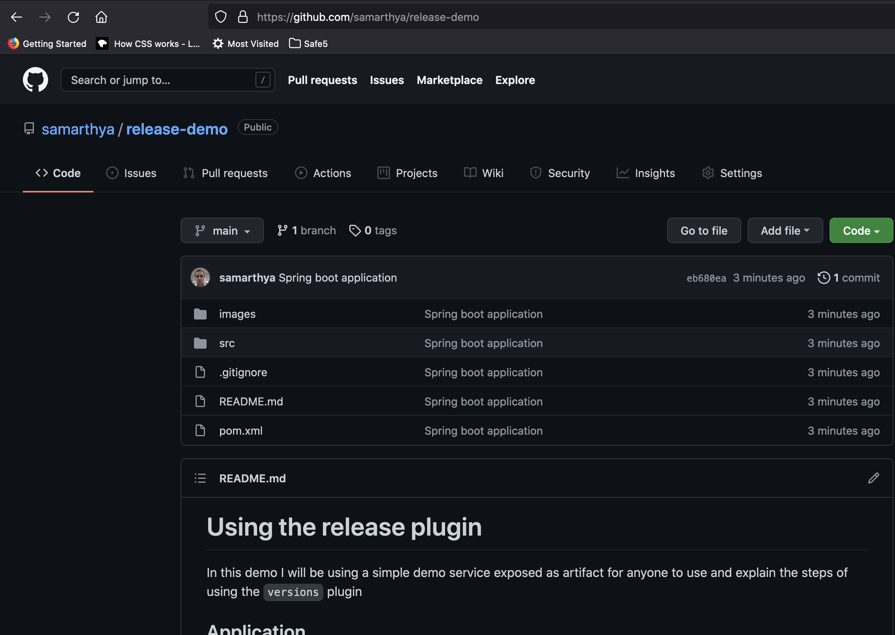

# Using the release plugin

In this demo I will be using a simple demo service exposed as artifact for anyone to use and explain the steps of using the `versions` plugin

## Application

The source creates a simple application with one rest endpoint exposed over 'http://<localhost>:8181/' and returns a string `"hello Spring!"`
### Step 1:
Configure the `spring-boot` application to run.

- You can simply execute `mvn spring-boot:run` and the application would start listening on the configured application port and you can validate the exposed end point by using `curl command`

#### curl -m2 http://localhost:8181/ -v

```bash
*   Trying 127.0.0.1...
* TCP_NODELAY set
* Connected to localhost (127.0.0.1) port 8181 (#0)
> GET / HTTP/1.1
> Host: localhost:8181
> User-Agent: curl/7.64.1
> Accept: */*
> 
< HTTP/1.1 200 
< Content-Type: text/plain;charset=UTF-8
< Content-Length: 13
< Date: Thu, 23 Sep 2021 08:41:17 GMT
< 
* Connection #0 to host localhost left intact
hello Spring!* Closing connection 0
- ```

Same can be verified in the browser


## Maven release plugin

Whatever I have used is well explained in the [Official Documentation](http://maven.apache.org/maven-release/maven-release-plugin/).

Assuming you code is available in your repository



### `maven deploy`

The snapshot build the original dev version can simply be deployed using maven clean deploy


```bash
[INFO] Tests run: 1, Failures: 0, Errors: 0, Skipped: 0, Time elapsed: 2.332 s - in me.samarthya.GreetingControllerTest
[INFO] 
[INFO] Results:
[INFO] 
[INFO] Tests run: 1, Failures: 0, Errors: 0, Skipped: 0
[INFO] 
[INFO] 
[INFO] --- maven-jar-plugin:2.4:jar (default-jar) @ release-demo ---
[INFO] Building jar: /Users/ss670121/sourcebox/github.com/release-demo/target/release-demo-1.0-SNAPSHOT.jar
[INFO] 
[INFO] --- spring-boot-maven-plugin:2.5.3:repackage (default) @ release-demo ---
[INFO] Replacing main artifact with repackaged archive
[INFO] 
[INFO] --- maven-install-plugin:2.4:install (default-install) @ release-demo ---
[INFO] Installing /Users/ss670121/sourcebox/github.com/release-demo/target/release-demo-1.0-SNAPSHOT.jar to /Users/ss670121/.m2/repository/me/samarthya/release-demo/1.0-SNAPSHOT/release-demo-1.0-SNAPSHOT.jar
[INFO] Installing /Users/ss670121/sourcebox/github.com/release-demo/pom.xml to /Users/ss670121/.m2/repository/me/samarthya/release-demo/1.0-SNAPSHOT/release-demo-1.0-SNAPSHOT.pom
[INFO] 
[INFO] --- maven-deploy-plugin:2.7:deploy (default-deploy) @ release-demo ---
Downloading from virtual-repo: http://reposerver.samarthya.me:8082/artifactory/virtual-maven-repo/me/samarthya/release-demo/1.0-SNAPSHOT/maven-metadata.xml
Uploading to virtual-repo: http://reposerver.samarthya.me:8082/artifactory/virtual-maven-repo/me/samarthya/release-demo/1.0-SNAPSHOT/release-demo-1.0-20210923.100706-1.jar
Uploaded to virtual-repo: http://reposerver.samarthya.me:8082/artifactory/virtual-maven-repo/me/samarthya/release-demo/1.0-SNAPSHOT/release-demo-1.0-20210923.100706-1.jar (19 MB at 3.1 MB/s)
Uploading to virtual-repo: http://reposerver.samarthya.me:8082/artifactory/virtual-maven-repo/me/samarthya/release-demo/1.0-SNAPSHOT/release-demo-1.0-20210923.100706-1.pom
Uploaded to virtual-repo: http://reposerver.samarthya.me:8082/artifactory/virtual-maven-repo/me/samarthya/release-demo/1.0-SNAPSHOT/release-demo-1.0-20210923.100706-1.pom (5.4 kB at 5.3 kB/s)
Downloading from virtual-repo: http://reposerver.samarthya.me:8082/artifactory/virtual-maven-repo/me/samarthya/release-demo/maven-metadata.xml
Downloaded from virtual-repo: http://reposerver.samarthya.me:8082/artifactory/virtual-maven-repo/me/samarthya/release-demo/maven-metadata.xml (371 B at 806 B/s)
Uploading to virtual-repo: http://reposerver.samarthya.me:8082/artifactory/virtual-maven-repo/me/samarthya/release-demo/1.0-SNAPSHOT/maven-metadata.xml
Uploaded to virtual-repo: http://reposerver.samarthya.me:8082/artifactory/virtual-maven-repo/me/samarthya/release-demo/1.0-SNAPSHOT/maven-metadata.xml (768 B at 853 B/s)
Uploading to virtual-repo: http://reposerver.samarthya.me:8082/artifactory/virtual-maven-repo/me/samarthya/release-demo/maven-metadata.xml
Uploaded to virtual-repo: http://reposerver.samarthya.me:8082/artifactory/virtual-maven-repo/me/samarthya/release-demo/maven-metadata.xml (316 B at 296 B/s)
[INFO] ------------------------------------------------------------------------
[INFO] BUILD SUCCESS
[INFO] ------------------------------------------------------------------------
[INFO] Total time:  16.564 s
[INFO] Finished at: 2021-09-23T15:37:23+05:30
[INFO] ------------------------------------------------------------------------
```

## The release plugin

`mvn release:prepare`
`mvn release:perform`
`mvn release:rollback`
