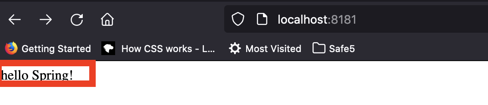

# Using the release plugin

In this demo I will be using a simple demo service exposed as artifact for anyone to use and explain the steps of using the `versions` plugin

## Application

The source creates a simple application with one rest endpoint exposed over 'http://<localhost>:8181/' and returns a string `"hello Spring!"`
### Step 1:
Configure the `spring-boot` application to run.

- You can simply execute `mvn spring-boot:run` and the application would start listening on the configured application port and you can validate the exposed end point by using `curl command`

#### curl -m2 http://localhost:8181/ -v

```bash
*   Trying 127.0.0.1...
* TCP_NODELAY set
* Connected to localhost (127.0.0.1) port 8181 (#0)
> GET / HTTP/1.1
> Host: localhost:8181
> User-Agent: curl/7.64.1
> Accept: */*
> 
< HTTP/1.1 200 
< Content-Type: text/plain;charset=UTF-8
< Content-Length: 13
< Date: Thu, 23 Sep 2021 08:41:17 GMT
< 
* Connection #0 to host localhost left intact
hello Spring!* Closing connection 0
- ```

Same can be verified in the browser



